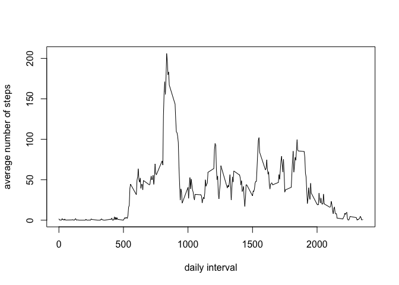

# Reproducible Research: Peer Assessment 1


## Loading and preprocessing the data

The data is loaded using read.csv. 


```r
dat <- read.csv("activity.csv")
```


We want to format the date from a factor into the Date format.

We have also created a second data frame, only containing rows with no missing values in the steps column. (I decided not to do this during loading as the rows with missing values will be needed/used later.) 

```r
dat$date <- as.Date(as.character(dat$date),"%Y-%m-%d")
dat2 <- dat[!is.na(dat$steps),]
```
Now we can start analyzing the data.

## What is mean total number of steps taken per day?
We want to plot a histogram of the number of steps per day.
The current format of the date gives an integer number of steps taken per interval on a given date. 

To find the number of breaks needed in the histogram, we want to find the number of days. 
First we need to load 'dplyr'

```r
library(dplyr)
```

```
## 
## Attaching package: 'dplyr'
## 
## The following object is masked from 'package:stats':
## 
##     filter
## 
## The following objects are masked from 'package:base':
## 
##     intersect, setdiff, setequal, union
```
Now we can group by date and find the number of days.

```r
days <- dat %>% group_by(date)
num_days <- dim(summarize(days))[1]
```
In order to use the 'hist' function within R, first we create a single vector, containing a date for each step taken which will allow the hist function to take the frequency of the steps per date. Then we can plot the histogram.


```r
stepsperday <- c(rep(dat2$date,dat2$steps))
hist(stepsperday,breaks=num_days,freq=TRUE,xlab="date",main="total number of steps taken per day",ylab="total number of steps",col="blue")
```

 

We can separate by date and produce a table containing the mean and median number of steps taken for each day. This is easily done using the 'dplyr' package/library, which was loaded previously.

```r
averages <- dat2 %>% group_by(date) %>% summarize(Meansteps=mean(steps), medianSteps = median(steps))
averages
```

```
## Source: local data frame [53 x 3]
## 
##          date Meansteps medianSteps
## 1  2012-10-02   0.43750           0
## 2  2012-10-03  39.41667           0
## 3  2012-10-04  42.06944           0
## 4  2012-10-05  46.15972           0
## 5  2012-10-06  53.54167           0
## 6  2012-10-07  38.24653           0
## 7  2012-10-09  44.48264           0
## 8  2012-10-10  34.37500           0
## 9  2012-10-11  35.77778           0
## 10 2012-10-12  60.35417           0
## ..        ...       ...         ...
```

The best way to view the mean data, as a whole, is via a time-series plot.

```r
plot(averages$date,averages$Meansteps,type='l',xlab="date",ylab="mean number of steps per day")
```

 

And the median data can be represented by the minimum and maximum.

```r
min(averages$medianSteps)
```

```
## [1] 0
```

```r
max(averages$medianSteps)
```

```
## [1] 0
```
This suggests the median may not be a good representation of the data.

## What is the average daily activity pattern?

In order to assess the average daily activity pattern, we need to select the 5-minute interval and average the number of steps over all days. (Note: this assumes the 'dplyr' has already been loaded.)

```r
activitypattern <- dat2 %>% group_by(interval) %>% summarize(av_steps = mean(steps))
```

This is then plotted on a time-series plot, here using the base plotting system.


```r
plot(activitypattern$interval,activitypattern$av_steps,type="l",
     xlab="daily interval",ylab="average number of steps")
```

 

To find the 5-minute interval containing the average maximum number of steps, we can use:


```r
max_steps <- activitypattern[activitypattern$av_steps == max(activitypattern$av_steps),]
max_interval <- max_steps$interval
```

The interval with the maximum activity (i.e number of steps) is interval 835, averaged over all days. As a check, we can see this roughly matches with the peak in the plot. 


## Imputing missing values

Here we are going back to using the raw data file we uploaded and investigate filling in the number of missing values. 

To start, we can find the number of missing values.


```r
missing <- sum(is.na(dat$steps))
missing
```

```
## [1] 2304
```

Therefore, there are 2304 values in the activity data frame.

After investigating the options for filling in the missing values, we decided to use the mean value for that given 5-minute time interval.
The means of the intervals were found using

```r
activitypattern <- dat2 %>% group_by(interval)  %>% summarize(av_steps = mean(steps))
```
which has also been used previously (and included here for clarify). 

A new data frame can be created with the missing steps values being filled in with the mean for that time interval.

```r
dat_nomissing <- dat
for (i in 1:dim(dat_nomissing)[1]){
    if(is.na(dat_nomissing$steps[i])){
    time_int <- dat_nomissing$interval[i] 
        dat_nomissing$steps[i] <- replace(dat_nomissing$steps[i], 
            is.na(dat_nomissing$steps[i]), 
            as.numeric(activitypattern[which(time_int == 
            activitypattern$interval),2]))
    }
}
head(dat_nomissing,10)
```

```
##        steps       date interval
## 1  1.7169811 2012-10-01        0
## 2  0.3396226 2012-10-01        5
## 3  0.1320755 2012-10-01       10
## 4  0.1509434 2012-10-01       15
## 5  0.0754717 2012-10-01       20
## 6  2.0943396 2012-10-01       25
## 7  0.5283019 2012-10-01       30
## 8  0.8679245 2012-10-01       35
## 9  0.0000000 2012-10-01       40
## 10 1.4716981 2012-10-01       45
```

We can make a new histogram, with the new data frame (containing the filled in missing values). To easily show the effect of the missing values and substituting in values, I have plotted both histograms below. The top histogram shows the number of steps taken per day with the missing values removed, and the bottom histogram show the number of steps taken per day when the missing values are substituted in with the average number of steps per time interval. 


```r
par(mfrow=c(2,1))

stepsperday <- c(rep(dat2$date,dat2$steps))

hist(stepsperday,breaks=num_days,freq=TRUE,xlab="date",main="total number of steps taken per day \n with missing values removed",ylab="total number of steps",col="blue")

stepsperday2 <- c(rep(dat_nomissing$date,dat_nomissing$steps))

hist(stepsperday2,breaks=num_days,freq=TRUE,xlab="date",main="total number of steps taken per day \n with missing values substituted ",ylab="total number of steps",col="blue")
```

 

From these plots, we can see the shape of the histogram has changed, with some gaps being filled in as we would expect.

To check exactly how substituting in the missing values on the total number of steps per day, we look at the mean and median of the new data.

```r
averages2 <- dat_nomissing  %>% group_by(date)  %>% summarize(Meansteps2=mean(steps), medianSteps2 = median(steps))
averages2
```

```
## Source: local data frame [61 x 3]
## 
##          date Meansteps2 medianSteps2
## 1  2012-10-01   37.38260     34.11321
## 2  2012-10-02    0.43750      0.00000
## 3  2012-10-03   39.41667      0.00000
## 4  2012-10-04   42.06944      0.00000
## 5  2012-10-05   46.15972      0.00000
## 6  2012-10-06   53.54167      0.00000
## 7  2012-10-07   38.24653      0.00000
## 8  2012-10-08   37.38260     34.11321
## 9  2012-10-09   44.48264      0.00000
## 10 2012-10-10   34.37500      0.00000
## ..        ...        ...          ...
```

To see if there is a difference in the two methods, we can compare the means and medians, first by merging the tables of means and medians. We only keep dates with values in both tables. (When the missing values are removed, some days have no data so there is nothing to compare with.)


```r
comp_table <- merge(averages,averages2,by.x="date")
head(comp_table,20)
```

```
##          date Meansteps medianSteps Meansteps2 medianSteps2
## 1  2012-10-02   0.43750           0    0.43750            0
## 2  2012-10-03  39.41667           0   39.41667            0
## 3  2012-10-04  42.06944           0   42.06944            0
## 4  2012-10-05  46.15972           0   46.15972            0
## 5  2012-10-06  53.54167           0   53.54167            0
## 6  2012-10-07  38.24653           0   38.24653            0
## 7  2012-10-09  44.48264           0   44.48264            0
## 8  2012-10-10  34.37500           0   34.37500            0
## 9  2012-10-11  35.77778           0   35.77778            0
## 10 2012-10-12  60.35417           0   60.35417            0
## 11 2012-10-13  43.14583           0   43.14583            0
## 12 2012-10-14  52.42361           0   52.42361            0
## 13 2012-10-15  35.20486           0   35.20486            0
## 14 2012-10-16  52.37500           0   52.37500            0
## 15 2012-10-17  46.70833           0   46.70833            0
## 16 2012-10-18  34.91667           0   34.91667            0
## 17 2012-10-19  41.07292           0   41.07292            0
## 18 2012-10-20  36.09375           0   36.09375            0
## 19 2012-10-21  30.62847           0   30.62847            0
## 20 2012-10-22  46.73611           0   46.73611            0
```
Comparing the medians, we can look at the ranges.
First with the missing values removed:


```r
min(comp_table$medianSteps)
```

```
## [1] 0
```

```r
max(comp_table$medianSteps)
```

```
## [1] 0
```
And then with the missing values substituted in:

```r
min(comp_table$medianSteps2)
```

```
## [1] 0
```

```r
max(comp_table$medianSteps2)
```

```
## [1] 0
```

So there are no differences with the median values.

It might be more informative to plot the mean per day for missing vs substituted. (The shape of the plot has been altered to best show this by making the size of the x-axis roughly the same as the y-axis.)


```r
plot(comp_table$Meansteps, comp_table$Meansteps2, pch=16,
     col="blue",xlab="mean - with missing values removed",
     ylab="mean - with missing values substituted")
fit1 <- lm(comp_table$Meansteps2 ~ comp_table$Meansteps)
abline(fit1)
```

 

The fit shows a direct correlation between the means, so substituting in the missing values does not change on the mean or median of the number of steps per day.
And if there is no impact on the mean, there will be no impact on the total number of steps per day.

## Are there differences in activity patterns between weekdays and weekends?

We will be using the data frame with the missing values filled in, the variable 'dat_nomissing' from the previous section. 

We need to convert the date into a day.

```r
datweekday <- weekdays(dat_nomissing$date)
dat_withday <- cbind(dat_nomissing,datweekday)
```
We can separate the weekdays and weekend into 2 data frames.


```r
weekend <- filter(dat_withday,grepl('Saturday|Sunday',datweekday))

week_day <- filter(dat_withday, grepl("Monday|Tuesday|Wednesday|Thursday|Friday",datweekday))
```

As we want to find the average number of steps per 5-minute interval, we sort by each data frame separately by interval. 


```r
weekend_intervals <- weekend  %>% group_by(interval)  %>% summarize(av_steps = mean(steps))
day <- rep("weekend",dim(weekend_intervals)[1])
weekend_intervals2 <- cbind(weekend_intervals,day)
head(weekend_intervals2)
```

```
##   interval    av_steps     day
## 1        0 0.214622642 weekend
## 2        5 0.042452830 weekend
## 3       10 0.016509434 weekend
## 4       15 0.018867925 weekend
## 5       20 0.009433962 weekend
## 6       25 3.511792453 weekend
```

```r
week_day_intervals <- week_day  %>% group_by(interval)  %>% summarize(av_steps = mean(steps))
day <- rep("weekday",dim(week_day_intervals)[1])
week_day_intervals2 <- cbind(week_day_intervals,day)
head(week_day_intervals2)
```

```
##   interval   av_steps     day
## 1        0 2.25115304 weekday
## 2        5 0.44528302 weekday
## 3       10 0.17316562 weekday
## 4       15 0.19790356 weekday
## 5       20 0.09895178 weekday
## 6       25 1.59035639 weekday
```

The 2 data frames are then combined into a single data frame

```r
Full_Intervals <- rbind(weekend_intervals2,week_day_intervals2)
```
Using the lattice, the average number of steps per time interval can be plotted with the values for the weekdays and weekend plotted separately.

```r
library(lattice)

Full_Intervals <- transform(Full_Intervals,Day = factor(day))
xyplot(av_steps ~ interval | Day, data = Full_Intervals, layout = c(1,2),type='l',xlab="Interval",ylab="Number of steps")
```

 


Looking at this plot, you can see, assuming the clock starts at mid-night,  the greatest peak during the weekday is in the morning when people are likely getting up and heading out for work. There are smaller peaks in the 'evening' (again assuming the start time is midnight) which suggests the people leaving work at scattered times.

During the weekend, the activity is more spread out over the time, with a number of people getting up later and moving around later in the evening/night.
